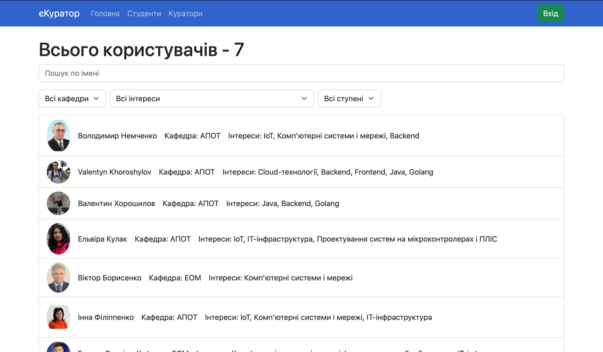
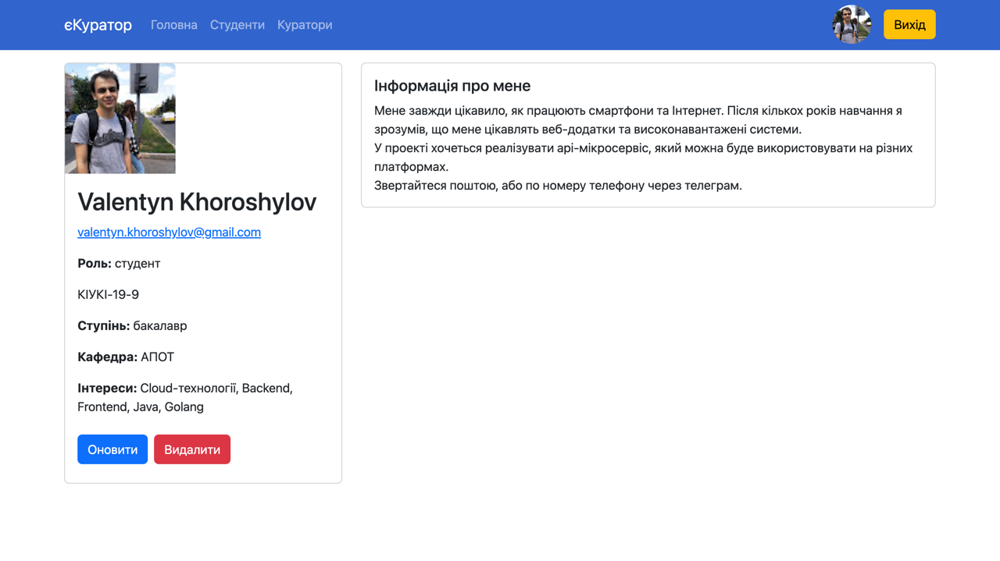
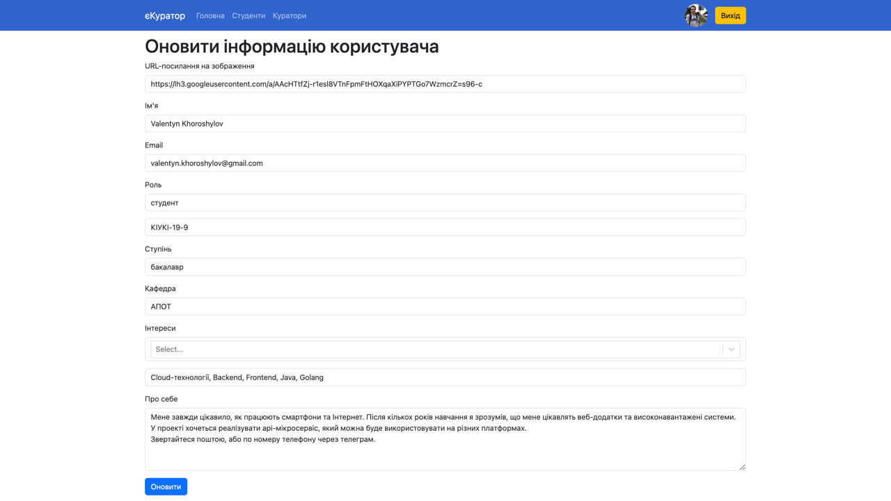
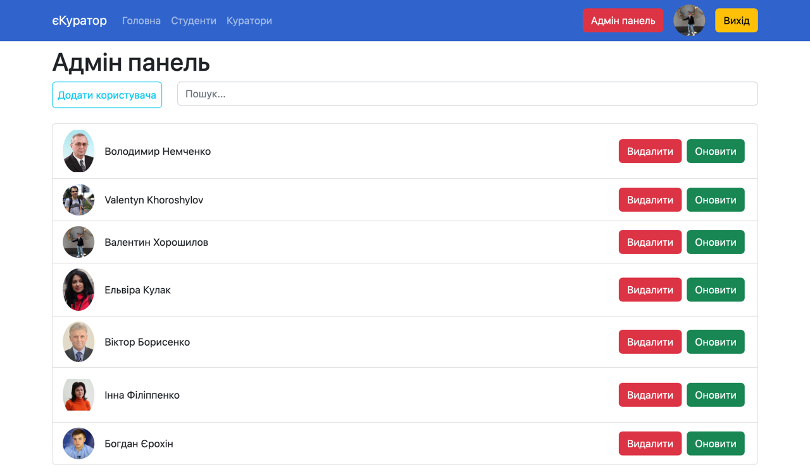

#  eKurator

eKurator is a web application designed for managing and visualizing JSON data. It consists of a React-based frontend client and a Go-based REST API backend server.

## Overview
 
 

The project is divided into two main components:

### Frontend Client [client README](client/README.md)

The frontend client is a React-based web application that provides a user-friendly interface for managing and visualizing JSON data. It communicates with the backend server via REST API calls.

### Backend Server [server README](server/README.md)

The backend server is a Go-based REST API application that handles authentication, data storage, and retrieval. It interacts with a MySQL database using the GORM library and utilizes Google OAuth 2.0 for authentication.

## Prerequisites

Before running the application, ensure that you have the following prerequisites installed on your system:

- Docker
- Docker Compose

## Installation

1. Clone this repository to your local machine:

   ```bash
   git clone https://github.com/horoshi10v/eKurator.git
      ```
2. Change into the project directory:

   ```bash
   cd apiKurator

3. Set up the configuration:
   - Update the .env file in the server directory with your Google OAuth credentials, database connection details, and other necessary configurations.
   

4. Start the application by running the following command:

   ```bash
   docker-compose up --build
    ```
   
5. The frontend client will be accessible at `http://localhost:3000`, and the backend server will be running on `http://localhost:8080`.
